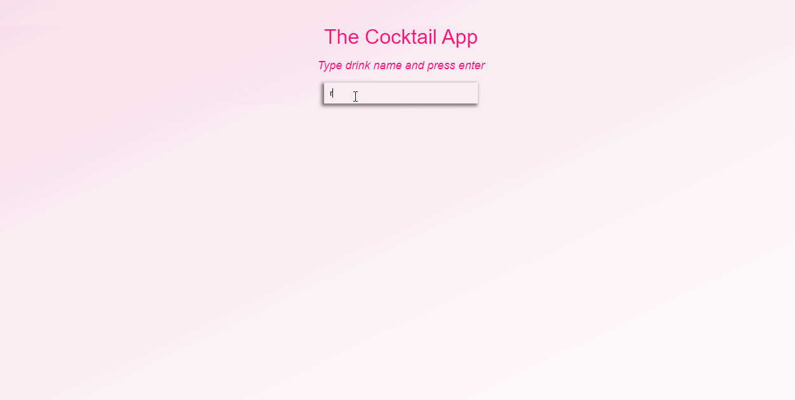

# Cocktail-App

This is a responsive application that provides users with access to cocktail recipes. Upon entering the drink name, or key ingredient into the search bar, a call to the CocktailDB API will return a full recipe including ingredient list, method, picture and how to serve instructions. You can see it working in the demo below.

## Technologies

This web application was bult with ReactJS/CSS and the CocktailDB API.
